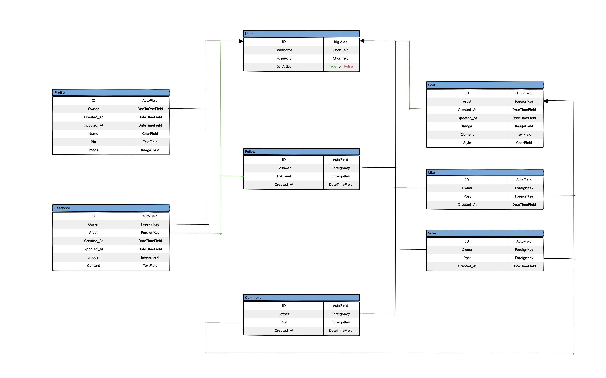
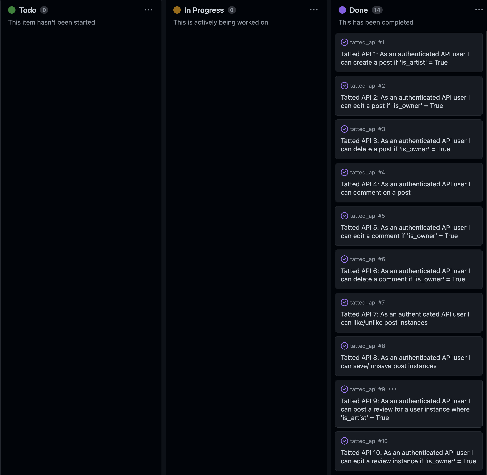

<h1>Tatted Backend API</h1>

<h2 id="contents">Contents</h2>

-   [Introduction](#introduction)
-   [Database Schema](#database-schema)
-   [User Stories](#user-stories)
-   [Agile Methodology](#agile-methodology)
-   [Technologies Used](#technologies-used)
    -   [Languages](#languages)
    -   [Frameworks, libraries, and Programs](#frameworks-libraries-and-programs)
-   [Testing (Automated and Manual)](TESTING.md)
-   [Bugs](#bugs)
-   [Deployment](#deployment)
    -   [Setting up JSON web tokens](#setting-up-json-web-tokens)
    -   [Prepare API for deployment to Heroku](#prepare-api-for-deployment-to-heroku)
    -   [Deployment to Heroku](#deployment-to-heroku)
    -   [Database Creation Elephant SQL](#elephantsql)
-   [Credits](#credits)
-   [Acknowledgements](#acknowledgements)

<h2 id="introduction">Introduction</h2>

This repository is the home of the backend API being used for the 'Tatted' application, made with the power of Django REST Framework (DRF).

The repository for the frontend 'Tatted' application can be found <a href="#">here</a>  

<h2 id="database-schema">Database Schema</h2>

The Database Schema contains the following model instances:
- Custom User
- Profile
- Post
- Comment
- Like
- Save
- Review
- Follow

<h2 id="user-stories">User Stories</h2>

The user stories used for the creation of this API were as follows:
- Tatted API 1: As an authenticated API user I can create a post if 'is_artist' = True
- Tatted API 2: As an authenticated API user I can edit a post if 'is_owner' = True
- Tatted API 3: As an authenticated API user I can delete a post if 'is_owner' = True
- Tatted API 4: As an authenticated API user I can comment on a post
- Tatted API 5: As an authenticated API user I can edit a comment if 'is_owner' = True
- Tatted API 6: As an authenticated API user I can delete a comment if 'is_owner' = True
- Tatted API 7: As an authenticated API user I can like/unlike post instances
- Tatted API 8: As an authenticated API user I can save/ unsave post instances
- Tatted API 9: As an authenticated API user I can post a review for a user instance where 'is_artist' = True
- Tatted API 10: As an authenticated API user I can edit a review instance if 'is_owner' = True
- Tatted API 11: As an authenticated API user I can delete a review instance where 'is_owner' = True
- Tatted API 12: As an authenticated API user I can follow/ unfollow other user instances
- Tatted API 13: As an authenticated API user I can edit my profile instance where 'is_owner' = True
- Tatted API 14: As an authenticated API user I can login/logout

<a href="#top">Back to the top.</a>

<h2 id="agile-methodology">Agile Methodology</h2>

he Agile Methodology was used thorughout the entire development of this application.  This was implemented by the means of a Github 'Project' which can be referenced here - <a href="https://github.com/users/ryanoneill416/projects/6" target="_blank"> Tatted Backend User Stories</a>

The project was used in a Kanban board style which was divided into the below categories:

-   Todo
-   In Progress
-   Done

Github issues were used to create User Stories and if any bugs or obstacles were to be tackled throughout the dev cycle. Issues were labelled in order to indicate importance of features. Each User Story, Fix or Update had a clear title outlining it's exact purpose.

<a href="#top">Back to the top.</a>

<h2 id="technologies-used">Technologies Used</h2>

<h3 id="languages">Languages</h3>

Python was solely used for the development of this backend API

<h3 id="frameworks-libraries-and-programs">Frameworks, Libraries and Programs Used</h3>

- Django Cloudinary Storage 
    - Storage of images in the cloud
- Django Filter
    - To filter the data
- PyJWT 
    - Python library which allows you to encode and decode JSON Web Tokens
- Psycopg
    - Psycopg is the most popular PostgreSQL database adapter for Python
- Pillow 
    - Image processing capabilities
- Git
    - For version control, committing and pushing to Github
- Github
    - For storing the repository, files and images pushed from Gitpod
- Gitpod
    - Browser based code editor used to develop the backend API
- Heroku
    - Used to deploy the backend API
- Django Rest Auth
    - Used for user authentication
- ElephantSQL
    - Used to host the PostgreSQL database
- gunicorn
    - As the Python WSGI HTTP Server
- Cors headers
    - To allow access from diferent domains
- Pycodestyle
    - For code validation

<a href="#top">Back to the top.</a>

<h2>Testing (Automated and Manual)</h2>

- This backend API application was tested using automated unit testing, manual testing as well as the use of pycodestyle validations
- Please find the testing results [here](/TESTING.md)